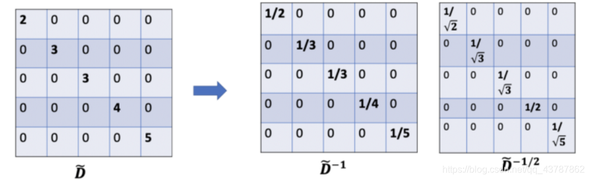

# 图卷积网络(Graph Convolutional Networks, GCN)详细介绍

本文翻译自[博客](https://www.topbots.com/graph-convolutional-networks/)。
在这篇博文中会为大家详细地介绍目前使用广泛的图神经网络——图卷积网络(Graph Convolutional Networks, GCN)的相关知识。首先将带领大家直觉上感受其工作原理，然后再介绍更深层的数学原理。

### 为什么要使用图(Graph)？

很多问题在本质是都可以表示为图的形式。在真实世界中，我们会发现很多数据其实是以图的形式存在的，比如分子网络，社交网络以及论文引用网络等等。

### 基于图的任务

针对图数据，通常有以下几种比较常见的任务类型：

- 结点分类(Node classification)：给定一个结点，预测其类型。
- 链路预测(Link prediction)：预测两个结点之间是否存在连接。
- 社区检测(Community detection)：确定具有紧密连接关系的结点簇。
- 网络相似度(Network similarity)：衡量两个网络或子网络之间的相似性。

### 机器学习工作流

在图中，我们不仅有**结点的特征**（结点的数据），还有**图的结构**（结点之间是如何进行连接的）。
对于前者，我们很容易可以获得关于每一个结点的数据，但是对于后者，要抽取出关于网络结构的信息并非易事。
例如，如果两个结点相较其它结点更加相近，那我们是否应该以不同的方式来对待它们？对于具有很高或很低度(degree)的结点又应该如何处理？
事实上，每一个特定的任务在特征工程上，也即通过构造特征来表示结构信息，都是非常耗时耗力的事情。例如在下面的结点分类的任务中，特征的构造是一项具有技巧性的工作。

将结点的特征与结构的信息同时作为输入，然后让机器自己去决定到底要利用哪些信息是非常有效且方便的方法，这也就是为什么我们需要**图表示学习**(Graph Representation Learning)的原因。

### 图卷积网络(GCN)

论文地址：[Semi-supervised Classification with Graph Convolutional Networks](https://arxiv.org/pdf/1609.02907.pdf)
**GCN**是一种能够**直接作用于图**并且利用其结构信息的**卷积神经网络**。
这篇文章解决的是在一个图中，只有少部分结点的标签是已知情况下(Semi-supervised learning)的结点分类问题。

### 主要思想

正如GCN名字中的**卷积**所揭示的，该思想是由图像领域迁移到图领域的。然而图像通常具有固定的结构，而图的结构却更加灵活、复杂。

**GCN的主要思想**：对于每个结点，我们都要考虑其所有邻居以及其自身所包含的特征信息。假设我们使用average()函数，那对每一个结点进行上述操作后，就可以得到能够输入到神经网络的平均值表示。

在上图中，我们以一个简单的引用网络为例。每一个结点代表一篇文章，而边代表代表引用情况。在这里首先有一个预处理的步骤，也就是将论文的原始文本通过NLP嵌入的方法先转化为向量。
接下来让我们考虑绿色结点。首先得到包括其自身的所有节点的特征值，然后取平均，然后该平均值向量可以输入到一个神经网络中，再得到一个向量。
上面的例子使用的是平均值函数，然而在实际应用当中我们可以采用更为复杂的聚合函数，GCN神经网络的结构也可以比上面图中的网络结构更复杂。如下图就是一个两层全连接GCN的例子，每一层的输出都作为下一层的输入。

### 直观理解与数学原理

接下来进一步介绍GCN背后的数学原理。
首先我们需要确定一些符号：
对于给定的无向网络G = ( V , E ) G=(V,E)G=(V,E)，其中V VV中包含网络中所有的N NN个结点,v i ∈ V v_i\isin Vvi​∈V，E EE代表结点之间的边( v i , v j ) ∈ E (v_i,v_j)\isin E(vi​,vj​)∈E，邻接矩阵A ∈ R N × N A\isin R^{N\times N}A∈RN×N中的元素可以为二进制编码也可以是权重实数；度矩阵D i i = ∑ j A i j D_{ii}=\sum_j A_{ij}Dii​=∑j​Aij​；结点的特征向量矩阵为X ∈ R N × C X\isin R^{N\times C}X∈RN×C，其中N NN为结点数，C CC为特征向量的维数。
让我们考虑如下的一个图：

我们要如何才能够得到一个结点的邻居的特征向量的信息呢？一个可能的解决方法就是将A AA与X XX进行相乘。

首先让我们看邻接矩阵的第一行，可以看到结点A连接着结点E。而结果矩阵中的第一行其实就是结点E的特征向量。类似地，结果矩阵中的第二行就是界定D与结点E的加和。通过这样一种处理，我们可以得到结点所有邻居的特征加和向量。
但是这样的处理存在着一些问题：

- 我们遗漏了所分析的结点本身的信息，比如，结果矩阵的第一行中应该包含结点A的信息才对。
- 我们应该使用平均值函数甚至是更好的加权平均值函数而非直接加和来处理邻居的特征向量。那为什么**不能直接使用加和函数**呢？原因就在于，当使用加和函数的时候，具有较大度值的结点会有很大的表示向量，而较低度的结点会有较小的聚合向量，这可能会导致**梯度爆炸**或**梯度消失**的问题（比如使用sigmoid函数时）。此外，神经网络对于输入数据的标度是非常敏感的，我们需要将这些向量进行标准化以消除潜在的问题。

针对第一点问题，可以通过在A AA的基础上加上一个单位阵得到新的邻接矩阵A ~ \tilde AA~
A ~ = A + λ I N \tilde{A}=A+\lambda I_NA~=A+λIN​
当λ \lambdaλ的取值为1时，意味着结点本身特征的重要性与其邻居的重要性一样，此时有A ~ = A + I N \tilde{A}=A+ I_NA~=A+IN​。需要注意的是，λ \lambdaλ本身是一个可以由训练得到的参数，但是为了方便，本文将其取值定为1。

对于第二点问题，我们通常会给结果矩阵再乘上一个对角阵以实现矩阵的标准化。在这种情况下，我们可以对求和得到的特征向量取平均，或者根据结点的度去对和向量矩阵A ~ X \tilde{A}XA~X进行标准化。直觉告诉我们这里所需要用到的对角阵是一个与度矩阵D ~ \tilde {D}D~相关的矩阵。
现在这个问题变成了**我们要如何标准化加和得到的向量？\**或者说\**我们如何将特定结点邻居的信息传递给该结点？**
在这里首先还是考虑取平均。在这种情况下，D ~ \tilde {D}D~的逆就派上用场。D ~ − 1 \tilde {D}^{-1}D~−1中的每一个元素其实D ~ \tilde {D}D~的倒数。

例如，结点A的度为2，那对于其和向量就要乘一个1 / 2 1/21/2，而结点E的度为5，对其和向量久要乘一个1 / 5 1/51/5。
由此，对D ~ − 1 \tilde{D}^{-1}D~−1与X XX进行相乘，可以得到包括结点自身以及其邻居的特征向量的均值。

使用均值看起来已经可以取得不错的效果，那么使用加权平均又如何呢？直觉上的感觉对具有高度和低度的结点采取不同的权重会有更好的效果。
在直接使用D ~ − 1 ( A ~ X ) \tilde{D}^{-1}(\tilde{A}X)D~−1(A~X)进行计算的时候有一个问题，就是仅对行进行了标准化而并没有对列进行标准化。

因此尝试使用D ~ − 1 A ~ D ~ − 1 X \tilde{D}^{-1}\tilde{A}\tilde{D}^{-1}XD~−1A~D~−1X进行标准化。
这种标准化的策略所提供的是一种**加权平均**，所实现的效果是会给予那些具有低度的结点更大的权重从而降低高度结点的影响。这种加权平均的想法在于那些具有较低度的结点会对其邻居有较大的影响，而高度的结点会产生更小的影响因为他们的影响会被分散给很多的邻居结点。

如上图所示，要得到结点B的聚合特征时，会分配较大的权重给B（其自身，度为3），而给E（度为5）更小的权重。
更进一步，为进一步优化标准化的策略，避免上述方法中的两次标准化，可以采用D ~ − 1 / 2 A ~ D ~ − 1 / 2 X \tilde{D}^{-1/2}\tilde{A}\tilde{D}^{-1/2}XD~−1/2A~D~−1/2X进行标准化。

比如我们要做一个十分类的任务，F FF就会被设置为10。在第二层的神经网络输出十维的向量后，就可以通过softmax函数进行预测，损失函数使用通常的交叉熵函数即可。

### GCN网络层数

#### 网络层数的含义

**网络的层数代表着结点特征所能到达的最远距离。\**比如一层的GCN，每个结点只能得到其一阶邻居身上的信息。对于所有结点来说，信息获取的过程是\**独立**、**同时开展**的。当我们在一层GCN上再堆一层时，就可以重复收集邻居信息的过程，并且收集到的邻居信息中已经包含了这些邻居结点在上一个阶段所收集的他们的邻居结点的信息。这就使得GCN的网络层数也就是每个结点的信息所能达到的**maximum number of hops**。因此，我们所设定的层的数目取决于我们想要使得结点的信息在网络中传递多远的距离。**需要注意的是，通常我们不会需要结点的信息传播太远。经过6~7个hops，基本上就可以使结点的信息传播到整个网络，这也使得聚合不那么有意义。**

#### 我们所使用的GCN应该有多少层？

在文章中，作者对于深层GCNs和浅层GCNs的效果开展了一些实验，由图可以看到，2~3层的网络应该是比较好的。当GCN达到7层时，效果已经变得较差，但是通过加上**residual connections between hidden layers**可以使效果变好。

### 小结笔记

- GCNs可以用于网络中的半监督学习问题
- GCNs可以用于学习网络中结点的特征与网络结构的信息
- GCN的主要思想是对每个结点的邻居及其自身的信息作加权平均，从而得到一个可以传入神经网络的结果向量。
- 可以通过加深GCNs以获得更大的信息传播范围，如果要较大的层数，需要残差连接以提升效果。通常使用2~3层的GCN。
- 当看到矩阵时，可以当作是一种矩阵标准化的过程。
- 有一个GCN的demo[库](https://stellargraph.readthedocs.io/en/stable/demos/node-classification/gcn-node-classification.html)，提供了一些包括GCN在内的GNN算法。

**注意：**本文所提出的框架目前仅适用于有权或无权的无向图。然后有向图是可以通过添加额外的结点转化为无相图的。